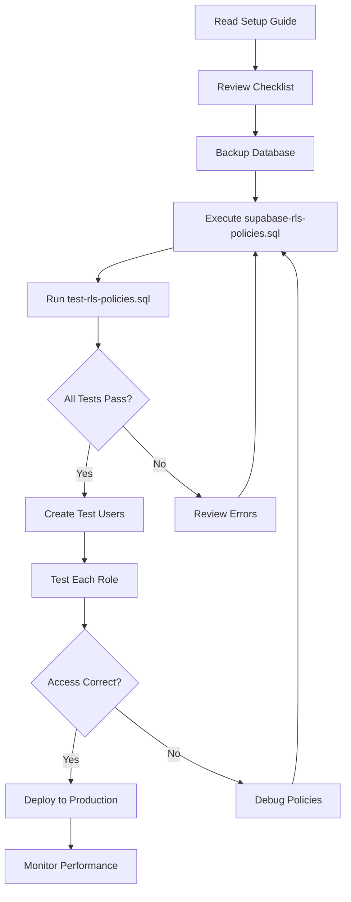

# Row-Level Security (RLS) Documentation Index

Complete documentation for implementing and managing Row-Level Security in Project 2052.

## Quick Start

New to RLS? Start here:

1. Read [RLS Quick Reference](./RLS_QUICK_REFERENCE.md) - 5 min overview
2. Follow [RLS Setup Guide](./RLS_SETUP_GUIDE.md) - 15 min setup
3. Use [Deployment Checklist](./RLS_DEPLOYMENT_CHECKLIST.md) - Ensure nothing is missed

## Documentation Files

### 1. SQL Scripts

#### [supabase-rls-policies.sql](./supabase-rls-policies.sql)
**Main RLS policy script - Execute this in Supabase SQL Editor**

- **Size:** 21 KB
- **Purpose:** Complete RLS implementation with all policies
- **Contents:**
  - Helper functions for role checking
  - RLS enablement for all tables
  - 30+ comprehensive policies
  - Grants and permissions

**When to use:**
- Initial deployment
- Updating policies after schema changes
- Re-applying policies after database refresh

**How to use:**
```
1. Open Supabase SQL Editor
2. Copy entire file contents
3. Execute script
4. Verify success message
```

---

#### [test-rls-policies.sql](./test-rls-policies.sql)
**Comprehensive testing and verification script**

- **Size:** 11 KB
- **Purpose:** Verify RLS is working correctly
- **Contents:**
  - 13 test sections
  - Automated verification queries
  - Security audit checks
  - Performance validation

**When to use:**
- After initial deployment
- After policy updates
- During security audits
- Troubleshooting access issues

**How to use:**
```
1. Execute after deploying RLS policies
2. Review each section's output
3. Verify all checks pass
4. Address any warnings
```

---

### 2. Setup and Configuration

#### [RLS_SETUP_GUIDE.md](./RLS_SETUP_GUIDE.md)
**Complete setup and configuration guide**

- **Size:** 7.3 KB
- **Sections:**
  - What is RLS?
  - Role-based access control explanation
  - Step-by-step setup instructions
  - Verification procedures
  - Testing guidelines
  - Security considerations
  - Troubleshooting
  - Maintenance procedures

**Audience:** DevOps, Database Administrators, Backend Developers

**When to use:**
- First time setting up RLS
- Training new team members
- Understanding RLS architecture
- Troubleshooting issues

---

#### [RLS_DEPLOYMENT_CHECKLIST.md](./RLS_DEPLOYMENT_CHECKLIST.md)
**Pre-deployment, deployment, and post-deployment checklist**

- **Size:** 6.5 KB
- **Sections:**
  - Pre-deployment preparation (6 tasks)
  - Deployment steps (16 steps)
  - Testing procedures
  - Security verification
  - Monitoring setup
  - Rollback plan

**Audience:** DevOps, Release Managers

**When to use:**
- Planning RLS deployment
- During deployment
- Post-deployment verification
- Emergency rollback

---

### 3. Reference Documentation

#### [RLS_QUICK_REFERENCE.md](./RLS_QUICK_REFERENCE.md)
**Quick reference card for daily use**

- **Size:** 5.6 KB
- **Contents:**
  - Role permissions matrix
  - Helper function reference
  - Common SQL queries
  - Policy patterns
  - Troubleshooting commands
  - Performance tips
  - Security best practices

**Audience:** All Developers

**When to use:**
- Daily development work
- Quick policy lookups
- Troubleshooting
- Writing new queries

---

## Role-Based Access Control

### Role Overview

| Role | Access Level | Use Case |
|------|-------------|----------|
| **ADMIN** | Full CRUD access to all data | System administrators, DevOps |
| **PLANNER** | Create/manage own proposals | Financial planners, analysts |
| **VIEWER** | Read-only access | Board members, stakeholders |

### Permission Matrix

See detailed matrix in [RLS_QUICK_REFERENCE.md](./RLS_QUICK_REFERENCE.md#role-permissions-matrix)

## Tables with RLS

All 10 tables have RLS enabled:

1. **User** - User accounts and roles
2. **LeaseProposal** - Lease proposals and negotiations
3. **Scenario** - What-if scenarios
4. **SensitivityAnalysis** - Sensitivity analyses
5. **SystemConfig** - System configuration
6. **HistoricalData** - Historical financial data
7. **CapExAsset** - Capital expenditure assets
8. **CapExConfig** - CapEx configuration
9. **TransitionConfig** - Transition period configuration
10. **WorkingCapitalRatios** - Working capital ratios

## Helper Functions

Four SQL functions support RLS policies:

```sql
auth.get_user_role()          -- Returns: 'ADMIN', 'PLANNER', or 'VIEWER'
auth.get_user_id()            -- Returns: User UUID
auth.is_admin()               -- Returns: boolean
auth.is_admin_or_planner()    -- Returns: boolean
```

## Common Use Cases

### As a Developer

**Need to:** Understand what data current user can access
**Read:** [RLS_QUICK_REFERENCE.md](./RLS_QUICK_REFERENCE.md)
**Section:** Helper Functions

---

**Need to:** Write a query that respects RLS
**Read:** [RLS_QUICK_REFERENCE.md](./RLS_QUICK_REFERENCE.md)
**Section:** Common Queries

---

**Need to:** Troubleshoot permission denied error
**Read:** [RLS_SETUP_GUIDE.md](./RLS_SETUP_GUIDE.md)
**Section:** Common Issues and Solutions

---

### As a DevOps Engineer

**Need to:** Deploy RLS to production
**Read:** [RLS_DEPLOYMENT_CHECKLIST.md](./RLS_DEPLOYMENT_CHECKLIST.md)
**Execute:** [supabase-rls-policies.sql](./supabase-rls-policies.sql)
**Verify:** [test-rls-policies.sql](./test-rls-policies.sql)

---

**Need to:** Update policies after schema change
**Read:** [RLS_SETUP_GUIDE.md](./RLS_SETUP_GUIDE.md)
**Section:** Maintenance > Updating Policies

---

**Need to:** Audit security policies
**Execute:** [test-rls-policies.sql](./test-rls-policies.sql)
**Section:** Part 11 - Security Audit

---

### As a Database Administrator

**Need to:** Monitor RLS performance
**Read:** [RLS_QUICK_REFERENCE.md](./RLS_QUICK_REFERENCE.md)
**Section:** Performance Tips

---

**Need to:** Add RLS to new table
**Read:** [RLS_SETUP_GUIDE.md](./RLS_SETUP_GUIDE.md)
**Section:** Maintenance > Adding New Tables

---

## Deployment Workflow



## Testing Strategy

### 1. Automated Tests
Run [test-rls-policies.sql](./test-rls-policies.sql) to verify:
- RLS enabled on all tables
- Helper functions exist
- Policies cover all operations
- No security gaps

### 2. Manual Tests
Follow checklist in [RLS_DEPLOYMENT_CHECKLIST.md](./RLS_DEPLOYMENT_CHECKLIST.md):
- Test read access per role
- Test write access per role
- Test edge cases
- Verify performance

### 3. Integration Tests
From application code:
- Test API endpoints with different roles
- Verify error handling
- Check performance impact

## Troubleshooting Guide

| Issue | Quick Fix | Detailed Guide |
|-------|-----------|----------------|
| Permission denied | Check user role | [Setup Guide - Common Issues](./RLS_SETUP_GUIDE.md#common-issues-and-solutions) |
| Can't see any data | Verify JWT | [Setup Guide - Common Issues](./RLS_SETUP_GUIDE.md#common-issues-and-solutions) |
| Slow queries | Check indexes | [Quick Ref - Performance](./RLS_QUICK_REFERENCE.md#performance-tips) |
| Policy not applying | Verify RLS enabled | [Quick Ref - Troubleshooting](./RLS_QUICK_REFERENCE.md#troubleshooting-commands) |

## Security Best Practices

1. **Never bypass RLS in production**
   - Use authenticated role in client
   - Reserve service_role for backend only

2. **Validate JWT tokens**
   - Keep tokens short-lived
   - Implement refresh mechanism

3. **Monitor access patterns**
   - Log permission denied errors
   - Alert on unusual patterns

4. **Regular audits**
   - Run test-rls-policies.sql monthly
   - Review policies during code review
   - Update docs when policies change

See detailed practices in [RLS_SETUP_GUIDE.md](./RLS_SETUP_GUIDE.md#security-considerations)

## Performance Considerations

### Recommended Indexes

```sql
CREATE INDEX idx_user_email ON "User"(email);
CREATE INDEX idx_proposal_created_by ON "LeaseProposal"("createdBy");
CREATE INDEX idx_scenario_created_by ON "Scenario"("createdBy");
CREATE INDEX idx_sensitivity_created_by ON "SensitivityAnalysis"("createdBy");
```

See more in [RLS_QUICK_REFERENCE.md](./RLS_QUICK_REFERENCE.md#performance-tips)

## Maintenance Schedule

| Task | Frequency | Reference |
|------|-----------|-----------|
| Run test script | After each deployment | [test-rls-policies.sql](./test-rls-policies.sql) |
| Security audit | Monthly | [test-rls-policies.sql](./test-rls-policies.sql) Part 11 |
| Performance review | Quarterly | [Quick Ref](./RLS_QUICK_REFERENCE.md#performance-tips) |
| Policy review | With schema changes | [Setup Guide](./RLS_SETUP_GUIDE.md#updating-policies) |

## Additional Resources

### Internal Documentation
- [Prisma Schema](/prisma/schema.prisma) - Database schema definition
- [Supabase Configuration](/.mcp.json) - Supabase setup

### External Resources
- [Supabase RLS Documentation](https://supabase.com/docs/guides/auth/row-level-security)
- [PostgreSQL RLS Documentation](https://www.postgresql.org/docs/current/ddl-rowsecurity.html)
- [Prisma with Supabase](https://www.prisma.io/docs/guides/database/supabase)

## Getting Help

### For Setup Issues
1. Check [RLS_SETUP_GUIDE.md](./RLS_SETUP_GUIDE.md#common-issues-and-solutions)
2. Run diagnostic queries from [RLS_QUICK_REFERENCE.md](./RLS_QUICK_REFERENCE.md#troubleshooting-commands)
3. Review Supabase logs

### For Policy Questions
1. Check [RLS_QUICK_REFERENCE.md](./RLS_QUICK_REFERENCE.md#role-permissions-matrix)
2. Review policy patterns in [supabase-rls-policies.sql](./supabase-rls-policies.sql)
3. Run test script to verify current state

### For Performance Issues
1. Check indexes in [RLS_QUICK_REFERENCE.md](./RLS_QUICK_REFERENCE.md#performance-tips)
2. Review query plans
3. Monitor with pg_stat_statements

## Document Change Log

| Date | Version | Changes |
|------|---------|---------|
| 2024-11-25 | 1.0 | Initial RLS documentation created |

---

**Maintained By:** Project 2052 Team
**Last Updated:** November 25, 2024
**Documentation Version:** 1.0
