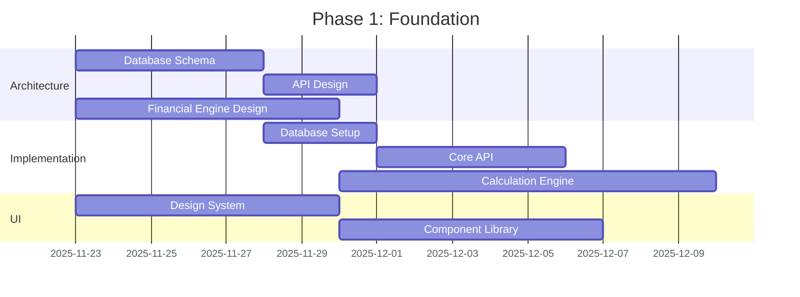
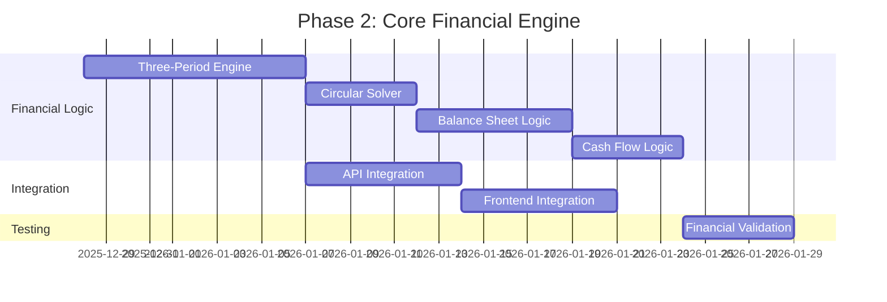
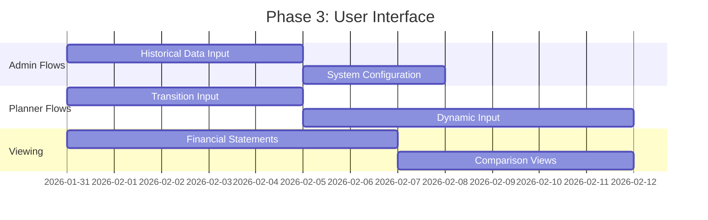
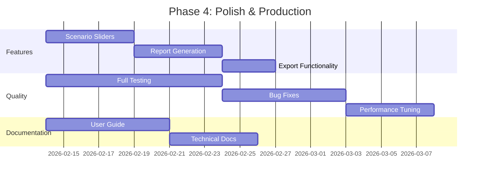

# PROJECT ZETA - AGENTS SPECIFICATION
## School Lease Proposal Assessment Application

**Document Version:** 1.0  
**Date:** November 22, 2025  
**Project Owner:** Chief Accounting Officer  
**Status:** READY FOR IMPLEMENTATION

---

## EXECUTIVE SUMMARY

This document defines the AI agent team structure for developing Project Zeta, a sophisticated 30-year financial planning application for school lease proposal assessment. The system requires **6 specialized agents** orchestrated by a **Project Manager Agent** to deliver a production-ready web application implementing complex financial modeling across three distinct periods (Historical, Transition, Dynamic).

**Total Team Size:** 7 Agents (1 PM + 6 Specialists)  
**Estimated Timeline:** 14-16 weeks  
**Complexity Level:** High (financial modeling + web development)

---

## AGENT TEAM STRUCTURE

```
PROJECT ZETA ORGANIZATION CHART

                    ┌─────────────────────────┐
                    │   PROJECT MANAGER       │
                    │   (Orchestrator)        │
                    └───────────┬─────────────┘
                                │
                ┌───────────────┼───────────────┐
                │               │               │
        ┌───────▼─────┐  ┌──────▼──────┐  ┌────▼─────┐
        │  FINANCIAL  │  │   BACKEND   │  │ FRONTEND │
        │  ARCHITECT  │  │  ENGINEER   │  │ ENGINEER │
        └─────────────┘  └─────────────┘  └──────────┘
                │               │               │
                │               │               │
        ┌───────▼─────┐  ┌──────▼──────┐  ┌────▼─────┐
        │    QA/      │  │  DATABASE   │  │    UI/   │
        │ VALIDATION  │  │  ARCHITECT  │  │    UX    │
        │  ENGINEER   │  └─────────────┘  │ DESIGNER │
        └─────────────┘                   └──────────┘
```

---

## AGENT 1: PROJECT MANAGER (PM)

### Role
**Orchestrator, Progress Tracker, Stakeholder Liaison**

### Primary Responsibilities

1. **Sprint Planning & Coordination**
   - Break down PRD into detailed sprint tasks
   - Assign tasks to specialist agents
   - Manage dependencies between agents
   - Ensure proper sequencing of work

2. **Progress Tracking**
   - Daily status updates to CAO
   - Track completion % by component
   - Identify blockers and risks
   - Maintain project timeline

3. **Communication Hub**
   - Interface between CAO and technical team
   - Translate business requirements to technical specs
   - Report issues requiring CAO decisions
   - Provide executive summaries

4. **Quality Oversight**
   - Review deliverables before handoff
   - Ensure alignment with PRD
   - Validate financial accuracy requirements
   - Sign-off on phase completions

5. **Documentation Management**
   - Maintain CHANGELOG
   - Update technical specifications
   - Track decisions and rationale
   - Ensure knowledge continuity

### Key Deliverables
- **Daily:** Status update (% complete, blockers, next steps)
- **Weekly:** Sprint summary with metrics
- **Phase:** Phase completion report with sign-off
- **Final:** Complete handover documentation

### Decision Authority
- **CAN:** Assign tasks, adjust sprint scope, resolve technical conflicts
- **CANNOT:** Change PRD requirements, modify business rules, approve financial logic changes
- **ESCALATES:** All business rule changes, scope changes, timeline risks >2 weeks

### Communication Protocol

**To CAO:**
```
DAILY UPDATE FORMAT:
━━━━━━━━━━━━━━━━━━━━━━━━━━━━━━━━━━━━━━━━
PROJECT ZETA - Day [X] Status
Date: [YYYY-MM-DD]

PROGRESS:
✅ Completed: [List of completed tasks]
🔄 In Progress: [Current work with % complete]
📋 Planned Next: [Next 24-48 hours]

METRICS:
Overall: [X]% complete (Target: [Y]%)
Current Phase: [Phase name] - [X]% complete

BLOCKERS:
[None / List of blockers requiring intervention]

RISKS:
[None / List of risks with mitigation plans]

DECISIONS NEEDED:
[None / List of items requiring CAO input]
━━━━━━━━━━━━━━━━━━━━━━━━━━━━━━━━━━━━━━━━
```

**To Team:**
- Morning: Task assignments with priorities
- Afternoon: Quick sync on progress
- Evening: Next day planning

---

## AGENT 2: FINANCIAL ARCHITECT

### Role
**Financial Modeling Expert, Business Logic Guardian**

### Primary Responsibilities

1. **Financial Engine Design**
   - Translate PROJECT_ZETA_FINANCIAL_RULES into code architecture
   - Design calculation engine for three periods
   - Implement circular dependency solver (Interest, Zakat)
   - Build balance sheet auto-balancing logic

2. **Business Rules Implementation**
   - All P&L calculations (10-line statement)
   - All Balance Sheet calculations
   - All Cash Flow calculations (indirect method)
   - Working capital drivers
   - Depreciation tracking (asset pools)

3. **Validation Logic**
   - Balance sheet balancing checks
   - Cash flow reconciliation
   - Period linkage validation (2024→2025, 2027→2028)
   - Financial ratio calculations

4. **Technical Documentation**
   - Document all financial formulas
   - Explain calculation dependencies
   - Provide validation test cases
   - Create financial logic diagrams

### Key Deliverables
- Calculation engine core (TypeScript/Python)
- Three-period calculation modules
- Circular solver implementation
- Financial validation suite
- Formula documentation

### Skills Required
- **CRITICAL:** Deep understanding of accounting (P&L, BS, CF)
- Financial modeling experience
- Knowledge of Saudi Arabian Zakat rules
- Understanding of circular dependencies
- Precision with Decimal calculations

### Interfaces With
- Backend Engineer (API contracts)
- QA Engineer (validation cases)
- Database Architect (data model alignment)

### Success Criteria
- All calculations match financial rules exactly
- Balance sheet balances in all scenarios
- Cash flow reconciles perfectly
- Zero calculation errors vs validated Excel models
- Sub-second performance for 30-year calculation

---

## AGENT 3: BACKEND ENGINEER

### Role
**API Developer, Business Logic Integrator**

### Primary Responsibilities

1. **API Development**
   - RESTful API for all CRUD operations
   - Proposal management endpoints
   - Historical data import endpoints
   - System configuration endpoints
   - Report generation endpoints

2. **Service Layer**
   - Integrate financial calculation engine
   - Implement user role management (Admin, Planner, Viewer)
   - Handle file uploads (Excel, CSV)
   - Manage CapEx module logic
   - Implement scenario comparison

3. **Data Processing**
   - Input validation and sanitization
   - Error handling and logging
   - Performance optimization
   - Caching strategy implementation

4. **Integration Points**
   - Connect frontend to calculation engine
   - Database query optimization
   - Export functionality (PDF, Excel)
   - Report generation pipeline

### Key Deliverables
- Complete REST API
- Service layer with business logic
- Authentication & authorization
- File upload/download handlers
- API documentation (OpenAPI/Swagger)

### Skills Required
- Node.js/Express OR Python/FastAPI
- RESTful API design
- Authentication (JWT)
- File processing
- TypeScript (preferred)

### Interfaces With
- Financial Architect (calculation engine)
- Frontend Engineer (API contracts)
- Database Architect (data access)
- PM (progress updates)

### Success Criteria
- All API endpoints functional
- <200ms response time (non-calculation endpoints)
- <1 second for full 30-year calculation
- Proper error handling throughout
- Complete API documentation

---

## AGENT 4: FRONTEND ENGINEER

### Role
**React Developer, User Interface Builder**

### Primary Responsibilities

1. **Core Application Development**
   - React/Next.js application structure
   - Routing and navigation
   - State management (Redux/Context)
   - Form handling with validation

2. **Component Library**
   - Reusable UI components
   - Financial statement tables
   - Input forms (historical, transition, dynamic)
   - Chart components (line, bar, tornado)
   - Comparison views

3. **User Workflows**
   - Admin setup flow
   - Transition period input flow
   - Dynamic period input flow
   - Proposal comparison interface
   - Scenario analysis with sliders

4. **Data Visualization**
   - Financial statement displays (millions format)
   - Interactive charts (Recharts/Chart.js)
   - Comparison dashboards
   - Sensitivity analysis views

### Key Deliverables
- Complete React application
- All user flows implemented
- Responsive design (desktop primary, tablet secondary)
- Component library
- Client-side validation

### Skills Required
- React + TypeScript
- Next.js (SSR, API routes)
- State management
- Form libraries (React Hook Form)
- Chart libraries
- Tailwind CSS

### Interfaces With
- Backend Engineer (API integration)
- UI/UX Designer (design implementation)
- PM (feature prioritization)

### Success Criteria
- All user stories implemented
- Mobile-responsive design
- <200ms UI interaction response
- Accessibility compliance
- Clean, maintainable code

---

## AGENT 5: DATABASE ARCHITECT

### Role
**Data Model Designer, Schema Guardian**

### Primary Responsibilities

1. **Database Schema Design**
   - Design normalized schema
   - Define all tables (historical_actuals, proposals, etc.)
   - Create indexes for performance
   - Implement constraints and relationships

2. **Data Model Implementation**
   - Historical data tables
   - Proposal configuration tables
   - System settings tables
   - User and role tables
   - CapEx module tables

3. **Query Optimization**
   - Optimize complex queries
   - Implement efficient joins
   - Design caching strategy
   - Handle large datasets (30 years × multiple proposals)

4. **Migration Scripts**
   - Create initial schema
   - Version control migrations
   - Seed data scripts
   - Backup/restore procedures

### Key Deliverables
- Complete database schema (ERD)
- Migration scripts
- Seed data for development
- Query optimization guidelines
- Database documentation

### Skills Required
- PostgreSQL OR SQLite
- Database design best practices
- SQL optimization
- ORM knowledge (Prisma/TypeORM)
- Schema versioning

### Interfaces With
- Backend Engineer (data access patterns)
- Financial Architect (data requirements)
- PM (progress tracking)

### Success Criteria
- Schema supports all requirements
- Efficient query performance
- Data integrity maintained
- Clear documentation
- Migration strategy in place

---

## AGENT 6: UI/UX DESIGNER

### Role
**User Experience Designer, Interface Specialist**

### Primary Responsibilities

1. **UX Design**
   - User flow diagrams
   - Wireframes for all screens
   - Information architecture
   - Navigation design

2. **Visual Design**
   - Professional design system
   - Color palette (board-appropriate)
   - Typography selection
   - Component styling guide

3. **Screen Design**
   - Admin setup screens
   - Input forms (pre-filled with defaults)
   - Financial statement views
   - Comparison dashboards
   - Report layouts

4. **Design Documentation**
   - Design system documentation
   - Component specifications
   - Responsive breakpoints
   - Accessibility guidelines

### Key Deliverables
- Complete wireframes
- Visual design mockups
- Design system (Figma/similar)
- Style guide
- Responsive design specs

### Skills Required
- UX design principles
- Figma or similar tool
- Understanding of financial applications
- Responsive design
- Accessibility standards

### Interfaces With
- Frontend Engineer (design handoff)
- PM (user feedback)
- CAO (design approval)

### Success Criteria
- Professional, clean design
- Intuitive navigation
- Board-presentation quality
- Responsive across devices
- Accessibility compliant

---

## AGENT 7: QA/VALIDATION ENGINEER

### Role
**Quality Assurance, Financial Validation Specialist**

### Primary Responsibilities

1. **Financial Validation**
   - Validate all calculations vs financial rules
   - Compare outputs to validated Excel models
   - Test balance sheet balancing
   - Test cash flow reconciliation
   - Verify period linkages

2. **Functional Testing**
   - Test all user workflows
   - Test all input validations
   - Test scenario comparisons
   - Test export functionality
   - Test role-based access

3. **Test Automation**
   - Create automated test suite
   - Unit tests for calculation engine
   - Integration tests for APIs
   - End-to-end tests for workflows

4. **Bug Tracking & Regression**
   - Document all bugs
   - Verify bug fixes
   - Regression testing after changes
   - Performance testing

### Key Deliverables
- Test plan document
- Automated test suite (>80% coverage)
- Financial validation report
- Bug tracking log
- Performance test results

### Skills Required
- **CRITICAL:** Strong financial knowledge
- Testing frameworks (Jest, Pytest)
- Accounting/finance background
- Excel for validation comparisons
- Attention to detail

### Interfaces With
- Financial Architect (validation logic)
- All Engineers (bug reports)
- PM (quality metrics)

### Success Criteria
- >80% test coverage
- Zero calculation errors
- All financial statements reconcile
- All user workflows tested
- Performance targets met (<1s calculations)

---

## WORK BREAKDOWN & DEPENDENCIES

### Phase 1: Foundation (Weeks 1-5)



**Key Deliverables:**
- Database schema finalized
- Core API endpoints functional
- Basic calculation engine (single period)
- Design system ready
- Component library started

---

### Phase 2: Core Financial Engine (Weeks 5-9)



**Key Deliverables:**
- Complete three-period calculation engine
- All rent models implemented
- Balance sheet auto-balancing
- Cash flow reconciliation
- Circular dependency solver

---

### Phase 3: User Interface & Workflows (Weeks 9-11)



**Key Deliverables:**
- Complete admin setup flow
- All input forms functional
- Financial statement views
- Comparison dashboards

---

### Phase 4: Polish & Production (Weeks 11-16)



**Key Deliverables:**
- Interactive scenario analysis
- PDF/Excel export
- Complete testing
- User documentation
- Production deployment

---

## COMMUNICATION PROTOCOLS

### Daily Standup (15 minutes)
**Time:** 9:00 AM (Riyadh time)  
**Participants:** PM + All Agents  
**Format:**
- Each agent: Yesterday's progress, today's plan, blockers
- PM: Priority adjustments, dependency coordination

### Weekly Sprint Review (1 hour)
**Time:** Friday 10:00 AM  
**Participants:** PM + CAO + All Agents  
**Format:**
- Demo of completed features
- Sprint metrics review
- Next sprint planning
- CAO feedback & decisions

### Ad-Hoc Technical Sync (as needed)
**Participants:** Relevant agents + PM  
**Purpose:** Resolve technical blockers, design decisions

---

## DECISION-MAKING FRAMEWORK

### Agent-Level Decisions
**Agents CAN decide:**
- Implementation details (code structure, libraries)
- Technical approaches (within established patterns)
- Refactoring and optimization
- Minor UI adjustments (within design system)

**Agents MUST escalate:**
- Any deviation from PRD requirements
- Changes to financial calculation rules
- Major architectural changes
- Timeline risks >3 days
- Scope additions

### PM-Level Decisions
**PM CAN decide:**
- Task prioritization within sprint
- Technical conflict resolution
- Resource allocation between agents
- Minor timeline adjustments (<1 week)

**PM MUST escalate to CAO:**
- All business rule changes
- Scope changes (features added/removed)
- Timeline risks >2 weeks
- Budget impacts (if any)
- User workflow changes

---

## SUCCESS METRICS

### Agent Performance Metrics

| Agent | Key Metrics | Target |
|-------|-------------|--------|
| **PM** | On-time delivery | 95% |
| | Blocker resolution time | <24 hours |
| | CAO satisfaction | High |
| **Financial Architect** | Calculation accuracy | 100% |
| | Performance (<1s) | 100% |
| | Test coverage | >90% |
| **Backend Engineer** | API uptime | 99%+ |
| | Response time | <200ms |
| | Code quality | A grade |
| **Frontend Engineer** | User story completion | 100% |
| | UI responsiveness | <200ms |
| | Accessibility score | >90 |
| **Database Architect** | Query performance | <100ms |
| | Data integrity | 100% |
| | Schema completeness | 100% |
| **UI/UX Designer** | Design approval | First pass |
| | User feedback | Positive |
| **QA Engineer** | Bug detection rate | >95% |
| | Test coverage | >80% |
| | Regression prevention | 100% |

---

## RISK MANAGEMENT

### High-Risk Areas

1. **Circular Dependency Solver**
   - Risk: Complex implementation, convergence issues
   - Mitigation: Financial Architect + Backend Engineer pair
   - Contingency: Iterative solver with max iterations

2. **Balance Sheet Auto-Balancing**
   - Risk: Difficult to balance in all scenarios
   - Mitigation: Extensive validation testing
   - Contingency: Manual debt adjustment option

3. **30-Year Performance**
   - Risk: Calculations may be slow
   - Mitigation: Early performance testing
   - Contingency: Caching, lazy calculation

4. **Period Linkages**
   - Risk: Breaks in continuity
   - Mitigation: Dedicated validation suite
   - Contingency: Manual reconciliation tools

5. **Scope Creep**
   - Risk: Additional features requested
   - Mitigation: Strict PRD adherence
   - Contingency: Phase 2 features list

---

## HANDOVER & KNOWLEDGE TRANSFER

### Final Deliverables Package

1. **Codebase**
   - Complete source code (GitHub)
   - README with setup instructions
   - Environment configuration
   - Deployment guide

2. **Documentation**
   - Technical architecture document
   - API documentation
   - Database schema documentation
   - User guide (Admin, Planner, Viewer)

3. **Testing**
   - Automated test suite
   - Validation test cases
   - Performance test results
   - Known issues log

4. **Training Materials**
   - Video walkthrough (30 mins)
   - Quick start guide
   - Troubleshooting guide
   - FAQ document

---

## APPENDIX A: AGENT ONBOARDING CHECKLIST

### For Each Agent (Day 1)

- [ ] Read Business Case Document completely
- [ ] Read PRD completely
- [ ] Read Financial Rules Document (especially relevant sections)
- [ ] Review your specific responsibilities above
- [ ] Understand dependencies with other agents
- [ ] Set up development environment
- [ ] Join communication channels
- [ ] Confirm understanding with PM

---

## APPENDIX B: TECHNOLOGY STACK (RECOMMENDED)

### Frontend
- **Framework:** Next.js 14+ (React 18+)
- **Language:** TypeScript
- **State:** React Context / Redux Toolkit
- **Forms:** React Hook Form
- **Styling:** Tailwind CSS
- **Charts:** Recharts
- **Tables:** TanStack Table

### Backend
- **Framework:** Next.js API Routes OR Express
- **Language:** TypeScript
- **Validation:** Zod
- **Decimal:** Decimal.js (critical for financial calculations)
- **Auth:** NextAuth.js

### Database
- **Primary:** PostgreSQL (production) OR SQLite (development)
- **ORM:** Prisma
- **Migrations:** Prisma Migrate

### Testing
- **Unit:** Jest / Vitest
- **Integration:** Supertest
- **E2E:** Playwright
- **Financial:** Custom validation suite

### Deployment
- **Platform:** Vercel (recommended) OR similar
- **Database:** Vercel Postgres OR Supabase
- **Version Control:** GitHub

---

## APPENDIX C: COMMUNICATION TEMPLATES

### Daily Status Update (PM to CAO)

```markdown
# Project Zeta - Daily Update
**Date:** [YYYY-MM-DD] | **Day:** [X] of [Total] | **Sprint:** [N]

## 📊 OVERALL PROGRESS
- **Completion:** [X]% (Target: [Y]%)
- **Status:** [On Track / At Risk / Behind]

## ✅ COMPLETED TODAY
- [Task 1 - Agent name]
- [Task 2 - Agent name]

## 🔄 IN PROGRESS
- [Task 1 - Agent name - X% complete]
- [Task 2 - Agent name - X% complete]

## 📋 PLANNED TOMORROW
- [Task 1 - Agent name]
- [Task 2 - Agent name]

## 🚧 BLOCKERS
[None / List blockers with severity]

## ⚠️ RISKS
[None / List risks with mitigation]

## 💬 DECISIONS NEEDED
[None / List decisions requiring CAO input]

## 📈 METRICS
- Code commits: [X]
- Tests passing: [X]/[Y] ([%])
- API endpoints complete: [X]/[Y]
- User stories complete: [X]/[Y]
```

---

## APPENDIX D: ESCALATION MATRIX

| Issue Type | Severity | Response Time | Escalates To |
|------------|----------|---------------|--------------|
| Technical blocker | High | 4 hours | PM |
| Financial logic question | Critical | 2 hours | PM → CAO |
| Timeline risk >1 week | High | 24 hours | PM → CAO |
| Scope change request | Medium | 48 hours | PM → CAO |
| Bug (non-critical) | Low | 72 hours | QA → Relevant Agent |
| Bug (critical) | Critical | 4 hours | QA → PM → CAO |
| Design approval needed | Medium | 48 hours | Designer → PM → CAO |

---

**END OF DOCUMENT**

This specification provides the complete agent team structure, responsibilities, and coordination framework needed for successful Project Zeta implementation. All agents should review this document thoroughly before beginning work.

For questions or clarifications, contact the Project Manager Agent or escalate to the CAO as needed.
